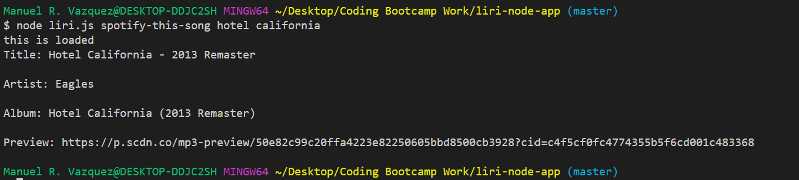

# liri-node-app
LIRI is a Language Interpretation and Recognition Interface that searches different databases for information based on user inputs by using node.js.
# Usage
Open the terminal and navigate to the local directory where the app is located

How to Use:

    1. "node liri.js" +
    (then specify the database you intend to search along with the search parameter)

    Spotify: "spotify-this-song" + "<insert song name here>"
    BandsInTown: "concert-this" + "<insert artist name here>"
    OMDB: "movie-this" + "<insert movie name here>"

EXAMPLE: If I want to search the Spotify API for the song "Hotel California" by The Eagles, the input on the command line would be:

    $ node liri.js spotify-this-song hotel california

    ----------->

This app was developed using node.js
The goal of this application is to retrieve API data from spotify, bandsintown, and OMDB

"spotify-this-song"
"concert-this"
"movie-this" 

