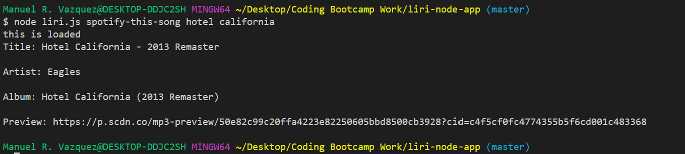

# liri-node-app
- LIRI is a Language Interpretation and Recognition Interface that searches different databases for information based on user inputs.
- The goal of this application is to retrieve API data from spotify, bandsintown, and OMDB using node.js
- The spotify-this functionality was coded in song.js and exported to liri.js using a constructor function. Modularization of this feature was done in order to improve the organization of the application and enhance code readability.

# HOW TO USE
1. Open the terminal and navigate to the local directory where the app is located

2. Run "node liri.js" + "(command)"

- Spotify: "spotify-this-song" + (song name)
    - EXAMPLE:
            ````
            $ node liri.js spotify-this-song hotel california
            ````

    - This will load the song title, artist, album, and preview link for the song.


- BandsInTown: "concert-this" + (artist name)
    - EXAMPLE:
            ````
            $ node liri.js concert-this acdc
            ````

    - Thid will load 


- OMDB: "movie-this" + (movie name)
    - EXAMPLE:
            ````
            $ node liri.js movie-this rambo
            ````
    
    - This will load the country of production, movie language, plot summary, and lead actresses/actors.


- Screenshots:
    

    


# Deployment
- The app requires the user to have their own .env file with their unique Spotify API key
